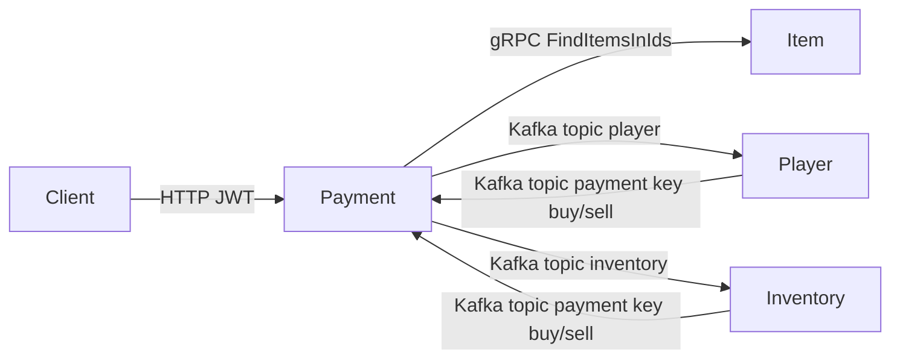
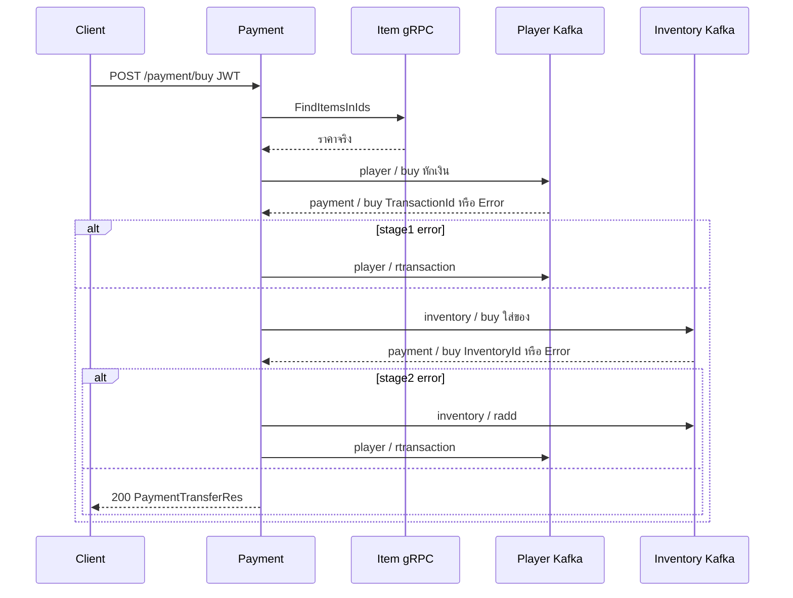
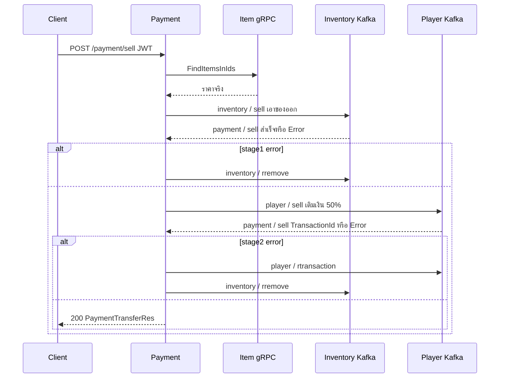

# Payment Service Detail

Payment เป็น **orchestrator ของการซื้อ-ขาย** ไม่ถือเงินและไม่ถือไอเทมเอง รับ HTTP จากผู้เล่น แล้วสั่งงานไปยัง **Item (gRPC)**, **Player (Kafka)** และ **Inventory (Kafka)** จากนั้นรอผลกลับมาที่ topic `payment` เพื่อทำ saga + rollback

## Payment อยู่ในระบบอย่างไร

แต่ละ service รันแยกตาม `server/server.go` (`playerService`, `itemService`, `inventoryService`, `paymentService`)

| Service | Payment คุยด้วยช่องทาง | หน้าที่ |
|---|---|---|
| **Item** | gRPC (`cfg.Grpc.ItemUrl`) | ตรวจว่าไอเทมมีจริง และดึงราคาจริง |
| **Player** | Kafka topic `player` → ตอบกลับ topic `payment` | หักเงิน / เติมเงิน / rollback transaction |
| **Inventory** | Kafka topic `inventory` → ตอบกลับ topic `payment` | เพิ่มของ / ลบของ / rollback inventory |

Payment เก็บใน Mongo แค่ **Kafka offset** ที่ `payment_db.payment_queue` ไม่มีตารางเงินหรือไอเทม

HTTP ที่เปิดไว้ (ต้องมี JWT):

- `POST /payment_v1/payment/buy`
- `POST /payment_v1/payment/sell`

`player_id` มาจาก JWT ไม่ได้มาจาก body

```go
payment.POST("/payment/buy", httpHandler.BuyItem, s.middleware.JwtAuthorization)
payment.POST("/payment/sell", httpHandler.SellItem, s.middleware.JwtAuthorization)
```

---

## ช่องทางสื่อสาร



**Request (Payment → อื่น):** push ผ่าน `queue.PushMessageWithKeyToQueue`

**Response (อื่น → Payment):** push กลับ topic `payment` เป็น `PaymentTransferRes` แล้ว Payment เปิด consumer ชั่วคราวรอ message ที่ key ตรงกับ `"buy"` หรือ `"sell"`

รูปแบบนี้คือ **request-reply ผ่าน Kafka** ไม่ใช่ HTTP ระหว่าง service

---

## Kafka topics และ keys

### Payment ส่งออก

| ฟังก์ชัน | Topic | Key | Payload |
|---|---|---|---|
| `DockedPlayerMoney` | `player` | `buy` | หักเงิน (amount ติดลบ) |
| `AddPlayerMoney` | `player` | `sell` | เติมเงิน (ขายได้ 50%) |
| `RollbackTransaction` | `player` | `rtransaction` | ลบ transaction |
| `AddPlayerItem` | `inventory` | `buy` | ใส่ของเข้ากระเป๋า |
| `RemovePlayerItem` | `inventory` | `sell` | เอาของออก |
| `RollbackAddPlayerItem` | `inventory` | `radd` | ลบ inventory ที่เพิ่งเพิ่ม |
| `RollbackRemovePlayerItem` | `inventory` | `rremove` | ใส่ของคืน |

### ฝั่งรับ (background goroutine)

- Player: `DockedPlayerMoney`, `AddPlayerMoney`, `RollbackPlayerTransaction`
- Inventory: `AddPlayerItem`, `RemovePlayerItem`, `RollbackAddPlayerItem`, `RollbackRemovePlayerItem`

### คำตอบกลับ Payment

- Player/Inventory สำเร็จหรือพลาด จะ push ไป topic `payment`
- ซื้อใช้ key `buy` / ขายใช้ key `sell`
- Payment ฟังด้วย `BuyOrSellConsumer` แล้วส่งผลเข้า channel

---

## Buy item — 2 ขั้น + rollback

ลำดับใน `BuyItem`:

### 0) ตรวจไอเทมผ่าน Item gRPC

รวม `item_id` ที่ไม่ซ้ำ แล้วเรียก `FindItemsInIds` ถ้าไม่มีของหรือ gRPC พัง จะตัดทันที จากนั้น **ทับราคาใน request ด้วยราคาจาก Item** เพื่อไม่ให้ client กำหนดราคาเอง

### Stage 1 — หักเงินที่ Player

ต่อแต่ละชิ้น:

1. push `{playerId, amount: -price}` ไป topic `player` key `buy`
2. เปิด consumer รอคำตอบบน topic `payment` key `buy`
3. Player ตรวจบัญชี → เงินไม่พอหรือหาบัญชีไม่ได้จะตอบ `Error` → ถ้าพอจะ insert `player_transactions` แล้วตอบ `TransactionId`

ถ้า stage 1 มี error ใดชิ้นหนึ่ง จะ **rollback ทุก transaction ที่หักไปแล้ว** (`rtransaction`) แล้วจบด้วย `buy item failed` **ยังไม่แตะ inventory**

### Stage 2 — ใส่ของเข้า Inventory

ถ้าหักเงินครบ:

1. push `{playerId, itemId}` ไป topic `inventory` key `buy`
2. รอคำตอบบน topic `payment` key `buy`
3. Inventory insert `players_inventory` แล้วตอบ `InventoryId`

ถ้า stage 2 พัง จะทำสองอย่าง:

1. rollback ของที่เพิ่มแล้ว (`radd` ลบตาม `InventoryId`)
2. rollback เงินที่หักแล้ว (`rtransaction`)

สำเร็จจะคืน `[]PaymentTransferRes` มีทั้ง `transaction_id` และ `inventory_id`



---

## Sell item — สลับลำดับ

ขายทำ **เอาของออกก่อน แล้วค่อยคืนเงิน 50%**

### 0) ตรวจไอเทม gRPC เหมือนซื้อ (ดึงราคาเต็ม)

### Stage 1 — ลบของจาก Inventory

1. push `{playerId, itemId}` ไป `inventory` key `sell`
2. Inventory หาของในกระเป๋า ถ้าไม่มีตอบ `"error: item not found"` ถ้ามีจะลบแล้วตอบสำเร็จ

ถ้าพัง จะ rollback เฉพาะชิ้นที่ลบสำเร็จ (`rremove` ใส่ของคืน) **ไม่ rollback ชิ้นที่หาของไม่เจอ**

### Stage 2 — เติมเงินที่ Player

1. push `{playerId, amount: price * 0.5}` ไป `player` key `sell`
2. Player insert transaction แล้วตอบ `TransactionId` บน topic `payment` key `sell`

ถ้า stage 2 พัง:

1. rollback เงิน (`rtransaction`)
2. ใส่ของคืน (`rremove`) ยกเว้นเคส item not found



---

## การรอคำตอบของ Payment

`BuyOrSellConsumer` ไม่ได้รันค้างแบบ Player/Inventory แต่ถูกเปิด **ทีละครั้งต่อ 1 ชิ้น**:

1. อ่าน offset จาก Mongo
2. consume partition `payment` จาก offset นั้น
3. รอ message แรกที่ key ตรง (`buy` หรือ `sell`)
4. เก็บ `offset+1` ลง Mongo
5. decode เป็น `PaymentTransferRes` ส่งเข้า channel

ดังนั้นแต่ละขั้นของแต่ละชิ้นเป็น **แบบบล็อกแบบลำดับ** HTTP จะไม่จบจนกว่า Kafka ไป-กลับครบ หรือ consumer error (`res == nil`)

`paymentQueueHandler` ใน `server/payment.go` ถูกสร้างแล้วทิ้งไว้ (`_ = queue`) ยังไม่มี consumer ระยะยาวฝั่ง payment เอง consumer อยู่ที่ usecase ตอน buy/sell

---

## สรุปบทบาทแต่ละฝั่ง

- **Payment** = ผู้กำกับ saga ไม่เขียนเงิน/ของเอง
- **Item** = แหล่งความจริงของแคตตาล็อกและราคา (sync gRPC)
- **Player** = แหล่งความจริงของเงิน (`player_transactions`)
- **Inventory** = แหล่งความจริงของของในกระเป๋า (`players_inventory`)

การเชื่อมต่อหลักจึงเป็น **choreography ผ่าน Kafka 3 topic** (`player`, `inventory`, `payment`) บวก **1 จุด sync คือ Item gRPC** ก่อนเริ่มซื้อหรือขาย
